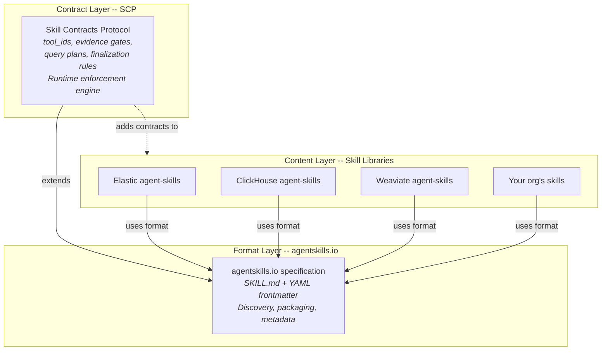

# SCP -- Skill Contracts Protocol

Declarative, enforceable contracts for LLM agent skills. Define what tools to use, what evidence to collect, and when to finalize.

## What is this?

LLM agents today either freestyle (no guardrails) or have orchestration logic baked into framework code. **SCP** puts that logic into a portable, declarative contract: what tools the agent can use, what steps it should follow, what evidence it must collect before it can finish. One spec, any framework -- drop it into Cursor skills, LangGraph, PydanticAI, or your own agent loop.

SCP extends the [agentskills.io](https://agentskills.io) format with enforceable runtime constraints. Every SCP file is also a valid `agentskills.io` skill -- SCP adds the *contract layer* on top.

## Ecosystem Positioning



## Quick Example

Add an `scp` constraints block to any SKILL.md frontmatter:

```yaml
---
scp: "1.0"
name: investigate-latency
description: Investigate service latency spikes
activation:
  triggers: [latency, slo burn, p99]
constraints:
  tool_ids:
    - run_es_query
    - generate_report
  plan:
    - tool: run_es_query
      description: Fetch raw latency data
      args_template:
        query: "FROM heartbeat-* | WHERE url.domain == '{{domain}}'"
    - tool: run_es_query
      description: Compute percentiles
  evidence:
    required:
      - id: data_presence
        description: Data exists for target service
      - id: latency_distribution
        description: Percentile stats are computed
  finalization:
    require_all_evidence: true
    min_iterations: 1
---

# Investigate Latency

Your regular skill markdown content here...
```

## Install

```bash
uv add skill-contracts-protocol
# or
pip install skill-contracts-protocol
```

## Validate skill files

```bash
scp validate path/to/skills/
```

## Check Elastic compatibility

```bash
scp elastic-check path/to/skills/
```

## Use the runtime

```python
from scp import load_skill
from scp.runtime import SkillEnforcer, EvidenceTracker, PlanExecutor

contract = load_skill("path/to/SKILL.md")
enforcer = SkillEnforcer(contract)
tracker = EvidenceTracker(contract)
planner = PlanExecutor(contract)

# In your agent loop:
for step in planner:
    result = your_tool_runner(step.tool, step.args)
    tracker.record(result)
    if enforcer.can_finalize(tracker):
        break
```

## Package Contents

| Module | Purpose |
|--------|---------|
| `scp.models` | Pydantic models: `SkillContract`, `Evidence`, `QueryStep`, `FinalizationRules` |
| `scp.loader` | Parse SKILL.md YAML frontmatter into `SkillContract` |
| `scp.validator` | Referential integrity checks (tool_ids vs plan steps) |
| `scp.cli` | CLI: `scp validate <file\|dir>`, `scp convert`, `scp elastic-check` |
| `scp.runtime` | Enforcement engine: `SkillEnforcer`, `EvidenceTracker`, `PlanExecutor` |
| `scp.adapters` | System-prompt builder + Elastic Agent Builder adapter |
| `scp.elastic_compat` | Elastic naming/limit validation |

## How is this different from agentskills.io?

`agentskills.io` defines the **format** (SKILL.md + YAML frontmatter) and focuses on discovery and packaging. SCP extends that format with a **contract layer** -- tool guardrails, evidence gates, query plans, and finalization rules -- plus a Python runtime that enforces those contracts at execution time.

## How is this different from Cursor skills?

Cursor skills tell the agent *what to do*; SCP tells it *how to stay on track* -- enforceable tool guardrails, evidence gates, and finalization rules that no SKILL.md can express today.

## License

MIT
